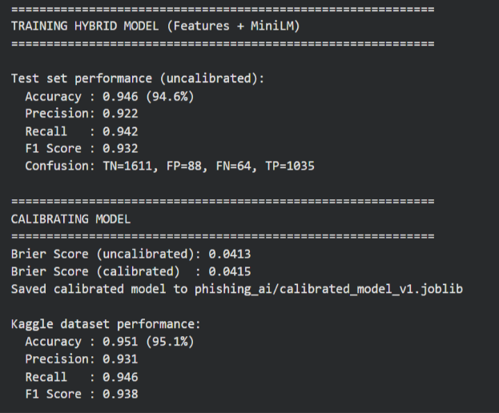
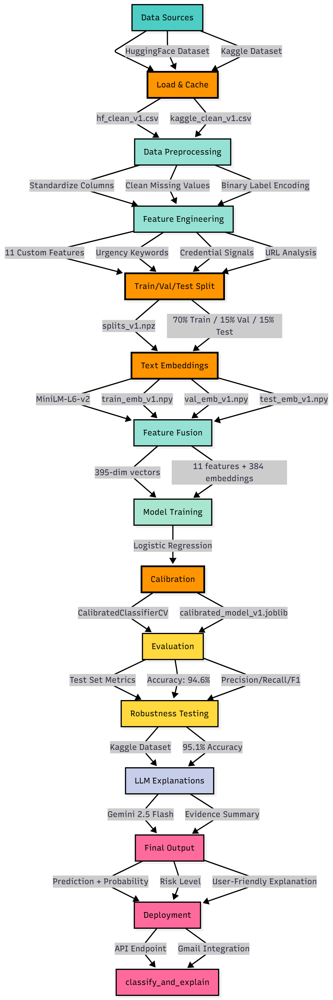
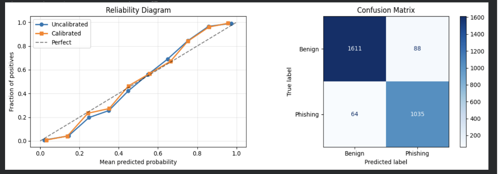

# Phishing Email Triage with Human-Readable Explanations

Most phishing filters work as black boxes — they flag an email as malicious but don't tell you *why*. This leaves incident responders guessing, users unable to learn, and analysts struggling to trust the system.

This project builds a full phishing triage pipeline that goes beyond binary detection. It assigns calibrated confidence scores, identifies the specific signals that triggered a classification, and generates plain-language explanations powered by Gemini 2.5 Flash — so a non-technical user knows exactly what to do.

> 📹 **Demo video available on request.**

---

## Results

| Dataset | Accuracy | Precision | Recall | F1 |
|---|---|---|---|---|
| HuggingFace (test set) | **94.6%** | 92.2% | 94.2% | 93.2% |
| Kaggle (robustness test) | **95.1%** | 93.1% | 94.6% | 93.8% |

The Kaggle dataset was never seen during training — strong generalization across different data sources and collection methods.



---

## How It Works



The pipeline has five stages:

**1. Feature Engineering** — 11 hand-crafted security indicators are extracted from each email: urgency keyword counts (`urgent`, `act now`, `immediately`), credential-related terms (`password`, `verify account`), URL analysis (count, raw IP addresses, suspicious TLDs like `.tk`/`.xyz`, encoded characters), excessive exclamation marks, and ALL-CAPS word counts. These capture what a security analyst looks for manually.

**2. Semantic Embeddings** — Each email is encoded into a 384-dimensional vector using `sentence-transformers/all-MiniLM-L6-v2`. This catches cleverly worded phishing that avoids obvious trigger words but still carries suspicious phrasing.

**3. Hybrid Model** — The 11 engineered features and 384 embedding dimensions are concatenated into a 395-dimension vector and fed into a Logistic Regression classifier. Fast, interpretable, and effective on high-dimensional data.

**4. Probability Calibration** — The model is calibrated using `CalibratedClassifierCV`. This ensures confidence scores are meaningful: if the model says 85% chance of phishing, roughly 85% of those cases truly are phishing. Without calibration, raw probabilities from classifiers are often poorly aligned with reality.



**5. LLM Explanations** — Gemini 2.5 Flash takes the model's probability and the specific features that fired, and generates a plain-language explanation with a risk level (🔴 High / 🟡 Medium / 🟢 Low) and actionable advice. Example output:

```
Risk Level: 🔴 HIGH (95% phishing probability)

This email creates a false sense of urgency and asks you to log in via a
suspicious IP-based link to verify your account. Do not click any links.
Delete this email and report it to your IT team.
```

---

## Architecture

```
Email Input
    ↓
Feature Engineering (11 indicators) + MiniLM Embeddings (384-dim)
    ↓
Feature Fusion → 395-dim hybrid vector
    ↓
Calibrated Logistic Regression
    ↓
Probability + Feature Hits → Gemini 2.5 Flash
    ↓
Verdict + Confidence Score + Plain-Language Explanation
    ↓
REST API / Gmail Forwarding Handler
```

---

## Quick Start

### 1. Install dependencies
```bash
pip install -r requirements.txt
```

### 2. Set your Gemini API key (optional — needed for LLM explanations)
```bash
export GEMINI_API_KEY=your_key_here
```

### 3. Run the API
```bash
uvicorn app:app --host 0.0.0.0 --port 8000
```

### 4. Classify an email
```bash
curl -X POST http://localhost:8000/classify \
  -H "Content-Type: application/json" \
  -d '{"email_text": "URGENT: Verify your account now or lose access!", "include_explanation": true}'
```

---

## API Endpoints

| Endpoint | Method | Description |
|---|---|---|
| `/classify` | POST | Classify email text. Returns label, probability, and explanation. |
| `/gmail-hook` | POST | Process a raw base64-encoded Gmail message (for forwarding workflows). |
| `/health` | GET | Health check. |

### `/classify` request body
```json
{
  "email_text": "...",
  "raw_headers": "...",
  "include_explanation": true
}
```

### `/classify` response
```json
{
  "label": "phishing",
  "phishing_probability": 0.95,
  "risk_level": "HIGH",
  "explanation": "This email creates a false sense of urgency..."
}
```

---

## Gmail Integration

Users can forward suspicious emails directly to a designated Gmail address. The `gmail_forwarder.py` script monitors the inbox, extracts email content, sends it to the `/gmail-hook` endpoint, and labels the original email with the verdict (`✅ Safe` / `⚠️ Phishing`).

See `_apps_script.txt` for the Google Apps Script that automates forwarding from any Gmail account.

---

## Caching System

Training embeddings and model artifacts are cached to disk after the first run. On subsequent runs, the pipeline loads from cache and skips retraining — reducing startup time from ~15–20 minutes to seconds. Cached artifacts:

- Cleaned datasets (`hf_clean_v1.csv`, `kaggle_clean_v1.csv`)
- Train/val/test split indices (`splits_v1.npz`)
- MiniLM embeddings (`train_emb_v1.npy`, etc.)
- Calibrated model (`calibrated_model_v1.joblib`)

---

## Dataset

| Source | Split | Purpose |
|---|---|---|
| [HuggingFace — zefang-liu/phishing-email-dataset](https://huggingface.co/datasets/zefang-liu/phishing-email-dataset) | 70 / 15 / 15 train/val/test | Primary training & evaluation |
| [Kaggle — subhajournal/phishingemails](https://www.kaggle.com/datasets/subhajournal/phishingemails) | Full set | Robustness / generalization test |

Both datasets are ~60% benign / 40% phishing. Stratified splits preserve this ratio across train/val/test.

---

## Limitations

- Header analysis (SPF/DMARC, Reply-To mismatches) is implemented but not yet deeply integrated into the final confidence score.
- The model was trained on public email datasets — performance on highly targeted spear-phishing may differ.
- Gemini explanations require an API key and internet access; a static template-based fallback is used otherwise.
- No live traffic analysis was performed during development.

---

## Future Work

- Deeper header analysis: domain similarity via Levenshtein distance, ARC/Received chain parsing
- Continual learning: log decisions and store samples for periodic retraining
- Local explanation fallback: template-based rationales for offline/air-gapped environments
- Browser extension or Outlook add-in integration

---

## Tech Stack

`Python` · `scikit-learn` · `sentence-transformers` · `FastAPI` · `Gemini 2.5 Flash` · `FAISS` · `Google Apps Script` · `uvicorn`

---

> 📹 Demo video available on request.